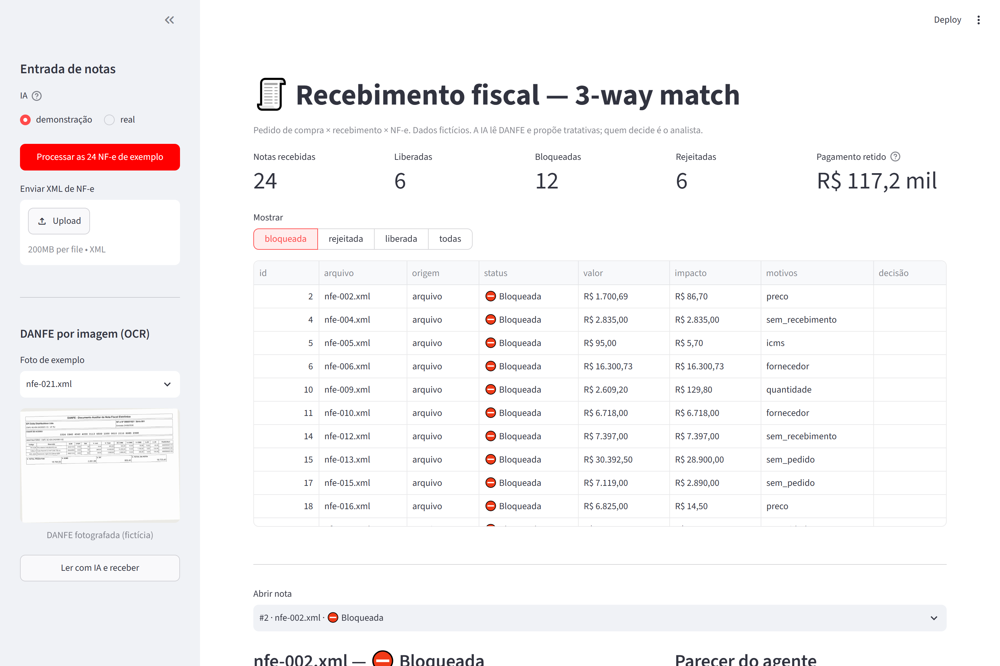
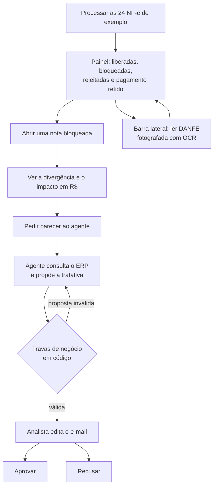
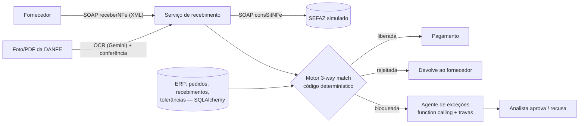
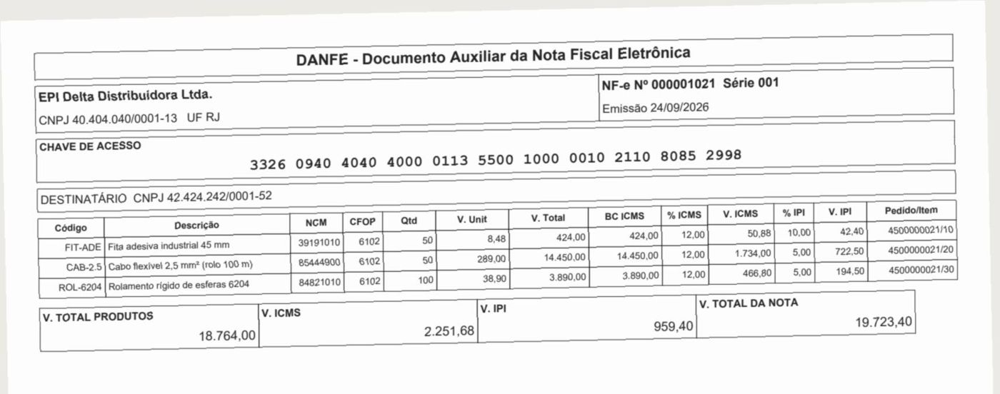
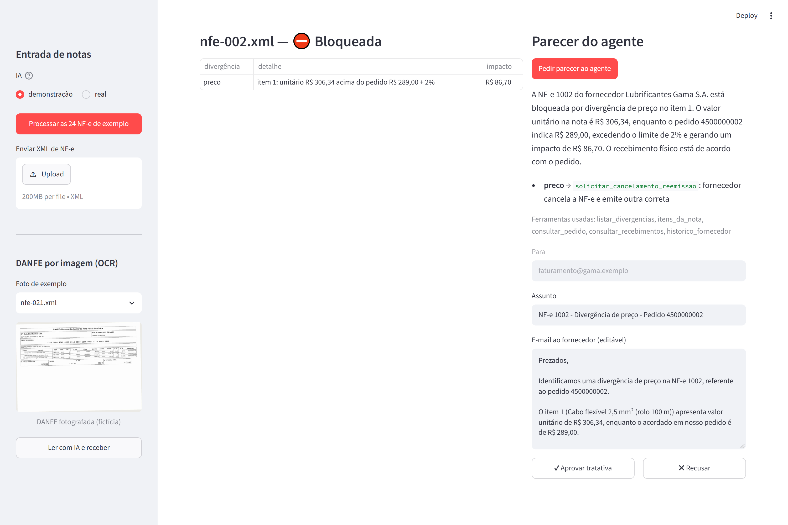

# Recebimento Fiscal Inteligente

[](https://github.com/diaquinodev/recebimento-fiscal/actions/workflows/ci.yml)

Automação do **recebimento de notas fiscais de fornecedor** em empresa com ERP corporativo:
confere cada NF-e contra o **pedido de compra** e o **recebimento físico** (o *3-way match*),
bloqueia o pagamento quando algo não bate e usa IA para **ler DANFE por imagem** e
**propor a tratativa** de cada exceção — com travas de negócio em código e aprovação humana.



## Teste online

**[recebimento-fiscal.streamlit.app](https://recebimento-fiscal.streamlit.app)** — modo
demonstração, sem cadastro e sem custo. Cada visitante tem o próprio banco: o que você aprova
não aparece para outra pessoa, e tudo volta ao zero ao fechar a aba.



Roteiro de 2 minutos: processe as notas, abra a `nfe-002.xml` (preço acima do pedido), peça o
parecer e aprove. Depois troque o filtro para **rejeitada** e veja por que as notas nem
chegaram ao match (chave inválida, duplicada, cancelada no SEFAZ).

## O problema

Antes de pagar um fornecedor, empresas grandes conferem três documentos:

| Documento | Em um ERP como o SAP | O que diz |
|---|---|---|
| Pedido de compra | `ME21N` | o que a empresa pediu e a que preço |
| Recebimento | `MIGO` | o que realmente chegou |
| Nota fiscal do fornecedor | `MIRO` (verificação) | o que está sendo cobrado |

Divergência de **preço, quantidade ou imposto** retém o pagamento e vira retrabalho entre
compras, fiscal e fornecedor ([Kamino](https://kamino.com.br/blog/3-way-matching/)). A solução
da SAP para a entrada de NF-e (NF-e GRC) está sendo descontinuada
([Midas](https://midassolutions.com.br/blog/nf-e-grc-descontinuado-conheca-alternativas/)),
e o mercado paga por alternativas. Este projeto reproduz esse processo de ponta
a ponta, com dados fictícios.

## O que ele faz



1. **Entrada por SOAP com WSDL** (`receberNFe`, NF-e em base64), como em integrações
   corporativas. Antes de aceitar, consulta a situação da nota em um **SEFAZ simulado**, no
   formato da consulta oficial (`consSitNFe` → `cStat` 100/101/110/217).
2. **NF-e XML layout 4.00** lida com parser seguro (sem XXE); dígito verificador da chave de
   acesso e do CNPJ conferidos.
3. **Motor de 3-way match em código**, item a item, com tolerâncias configuráveis (preço %,
   quantidade, imposto em R$). Resultado: **liberada**, **bloqueada** (com o impacto em R$) ou
   **rejeitada** (chave inválida, duplicada, cancelada no SEFAZ…).
4. **OCR/IDP de DANFE**: fornecedor que só manda foto. Um modelo de visão transcreve; o código
   confere chave, CNPJ, número e somas. Leitura que não fecha não entra.
5. **Agente de exceções** com 5 ferramentas sobre o ERP: investiga a nota bloqueada e propõe
   uma tratativa por divergência e o e-mail ao fornecedor. O analista aprova ou recusa.

<p align="center">
  
</p>

## IA onde há texto e imagem; código onde há regra e dinheiro

| Quem | Faz | Por quê |
|---|---|---|
| Código | tolerância, impostos, bloqueio, dígitos verificadores, conferência da leitura | determinístico, testável, auditável |
| IA (Gemini 2.5 Flash via OpenRouter) | ler a DANFE, investigar a exceção, redigir o e-mail | texto e imagem não estruturados |
| Humano | aprovar a tratativa | responsabilidade fiscal e financeira |

**Travas do agente, em código** — a proposta só é aceita se:
- a ação estiver entre as **permitidas para aquela divergência**. A carta de correção (CC-e)
  nunca é aceita para preço, quantidade, imposto ou emitente: ela não pode alterar esses
  dados (Convênio SINIEF s/nº de 1970, art. 7º) — o caminho é cancelar e reemitir;
- o texto **não sugerir CC-e** nesses casos (frases que a negam são aceitas);
- todo **valor em R$ do e-mail tiver vindo das ferramentas** (nada inventado);
- o agente tiver usado **pelo menos 2 ferramentas**;
- o destinatário do e-mail vem do **cadastro**, e a nota analisada é **fixada pelo código**
  (a IA não escolhe qual nota ler).



## Resultados medidos

Todos os evals rodam no CI. Os de IA usam **respostas reais gravadas** (`tests/gravacoes/`),
então o CI não precisa de chave nem de rede.

**Motor (20 cenários, 480 notas, 11 tipos de situação plantados):** 100% de detecção,
0% de falso bloqueio. Um teste sabota o motor de propósito e confirma que o eval acusa.

**OCR de 22 DANFEs "fotografadas" (inclinadas, borradas, JPEG):**

| | Prompt v1 | Prompt v2 (chave em grupos de 4) |
|---|---|---|
| Campos fiscais 100% corretos | 13/22 | **22/22** |
| Chaves de acesso lidas erradas | 9 — **todas barradas pelo dígito verificador** | 0 |
| Leitura errada aceita como certa | 0 | **0** |

Diferença restante: acento perdido em 4 descrições (texto, não valor).

**Agente nas 12 notas bloqueadas:**

| Versão | Pareceres válidos | O que aprendi |
|---|---|---|
| v1 | 11/12 | a trava olhava só o campo "ação"; o **e-mail** sugeria CC-e para preço |
| v2 | 6/12 | a trava nova barrava frases **corretas** ("**não** pode ser corrigida por CC-e") |
| v2 + negação | 12/12 | 4–5 ferramentas por nota |
| v3 (nota fixada pelo código) | **12/12** | 1 proposta de CC-e para item sem pedido barrada e corrigida pelo próprio agente |

## Lacunas de tecnologia que o projeto cobre

| Tema | Onde |
|---|---|
| SOAP/XML, WSDL | `soap.py`, `nfe_xml.py` |
| OCR / IDP | `danfe.py`, `ocr.py` |
| Function calling / agentes | `agente.py` |
| Banco relacional portável (SQLite → Oracle) | `erp.py` (SQLAlchemy 2, `Numeric`) |
| Eval de IA com gravação e reprodução | `avaliacao.py`, `ia.py` |

## Rodar localmente

Requer Python 3.12.

```bash
python -m venv .venv && .venv/Scripts/activate      # Windows (Linux/Mac: source .venv/bin/activate)
pip install -e ".[dev]"

streamlit run app.py                    # tela do analista (modo demonstração, sem chave)
python -m recebimento processar         # processa as 24 NF-e de exemplo no terminal
python -m recebimento api               # SOAP + WSDL + SEFAZ simulado em http://127.0.0.1:8000
python -m recebimento avaliar           # eval do motor
python -m recebimento avaliar-ocr       # eval do OCR (respostas gravadas)
python -m recebimento avaliar-agente    # eval do agente (respostas gravadas)

ruff check . && ruff format --check . && mypy src && pytest -q   # 72 testes
```

Modo real (chama a IA): defina `OPENROUTER_API_KEY` no ambiente e use `--gravar` nos evals ou
"real" na tela. A chave nunca vai para o código nem para o repositório.

## Estrutura

```
src/recebimento/
  dominio.py    pedido, recebimento, NF-e (Pydantic + Decimal)
  chave.py      chave de acesso e CNPJ: dígitos verificadores
  nfe_xml.py    NF-e XML 4.00: gerar, ler (sem XXE), conferir
  match.py      motor de 3-way match (função pura)
  erp.py        banco do ERP (SQLAlchemy) e decisões humanas
  servico.py    porta única de entrada (XML, SOAP, OCR)
  soap.py       SOAP de recebimento, WSDL, SEFAZ simulado e cliente
  api.py        FastAPI
  danfe.py      DANFE fictícia (PDF/imagem/"foto")
  ia.py         OpenRouter + gravação/reprodução
  ocr.py        leitura de DANFE com conferência em código
  agente.py     agente de exceções e travas de negócio
  gerador.py    ERP e NF-e fictícios com gabarito
app.py          tela Streamlit
tests/          72 testes + respostas reais gravadas da IA
```

## Limitações (de propósito ou ainda não feitas)

- **SEFAZ simulado.** A consulta real exige certificado digital da empresa (TLS mútuo).
- **NF-e simplificada:** sem assinatura digital, sem validação pelo XSD oficial, ICMS00/IPITrib
  apenas; alíquotas de ICMS simplificadas (18% em SP, 12% entre SP e Sul/Sudeste).
- **DANFE fictícia** com layout simplificado. Em produção, ler o **código de barras** da chave
  (determinístico) antes de recorrer ao modelo de visão.
- **Oracle:** a camada de dados usa tipos portáveis, mas **ainda não foi executada contra
  Oracle** (próxima fase, com Oracle Free em Docker).
- A leitura por imagem serve para **triagem**: o documento fiscal é o XML.
- O modo demonstração da tela reproduz respostas gravadas **só para o cenário de exemplo**.
- O link público não tem chave de IA configurada: lá, o modo "real" volta sozinho para a
  demonstração (ninguém gasta crédito da conta).

## Próximos passos

- Oracle Free em Docker no CI.
- RAG sobre política de compras e contratos ("posso liberar 3% acima para este fornecedor?").
- Deploy da API em nuvem.

---

Dados, empresas e CNPJs são fictícios. Feito por **Diego Aquino** · [MIT](LICENSE)
